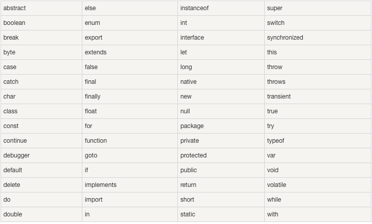

# JavaScript学习笔记

## 1 简介

- 将学到以下内容

  - JavaScript：直接写入 HTML 输出流

    > `document.write("");`，会在页面加载时执行
    >
    > 只能在 HTML 输出中使用 document.write，如果在文档加载后使用该方法，会覆盖整个文档


-   JavaScript：对事件的反应

    > `<button type = "button" onclick = "alert('欢迎！')>Click Me!</button>">`
    >
    > alert() 函数在 JavaScript 中并不常用，但它对于代码测试非常方便


-   JavaScript：改变 HTML 内容

    > `x=document.getElementById("demo")  //查找元素`
    > `x.innerHTML="Hello JavaScript";    //改变内容`
    >
    > HTML DOM 中定义的document.getElementById()，DOM(Document Object Model)（文档对象模型）是用于访问 HTML 元素的正式 W3C 标准


-   JavaScript：改变 HTML 图像

-   JavaScript：改变 HTML 样式

    > `x=document.getElementById("demo")  //找到元素` 
    > `x.style.color="#ff0000";           //改变样式`
    >
    > 改变 HTML 元素的样式，属于改变 HTML 属性的变种


- JavaScript：验证输入

## 2 JavaScript 用法

- 脚本可被放置在 HTML 页面的 <body> 和 <head> 部分中，或者保存在外部文件
- 若直接在`<script></script>`标签内插入代码，会在页面加载时执行；而如果将代码放在函数中，则可以在触发事件时执行
- 通常的做法是把函数放入 `<head>` 部分中，或者放在页面底部。这样就可以把它们安置到同一处位置，不会干扰页面的内容
- 导入外部javascript`<script src="myScript.js"></script>`

## 3 JavaScript输出

- 没有任何打印或输出的函数

- 显示数据的方法

  - `window.alert()`弹出警告框


-   `document.write()`将内容写到HTML文档中

    > 请使用 `document.write()` 仅仅向文档输出写内容。
    > 如果在文档已完成加载后执行 `document.write()`，整个 HTML 页面将被覆盖


-   `innerHTML`写入到HTML元素

    - ```javascript
      document.getElementById("demo"）.innerHTML = "段落被修改";
      ```

    - `document.getElementById("demo"）`使用id属性查找HTML元素

    - `innerHTML = "段落被修改"这里用于修改HTMl内容，也可获取`

-   console.log()`写入到浏览器的控制台

    > 浏览器中启用调试模式， 在调试窗口中点击 "Console" 菜单

## 4 JavaScript语法

### 4.1 字面量

- 常量，恒定的值


- 数字（Number），可以是整数、小数或者科学计数（e）

  ```javascript
  <p id="demo"></p>
  <script>
  document.getElementById("demo").innerHTML = 123e5;
  </script>
  ```

   


- 字符串（String），单引号或者双引号

  ```javascript
  <p id="demo"></p>
  <script>
  document.getElementById("demo").innerHTML = 'John Doe';
  </script>
  ```


- 表达式

  ```javascript
  <p id="demo"></p>
  <script>
  document.getElementById("demo").innerHTML = 5 * 10;
  </script>
  ```


- 数组（Array）：`[40, 100, 1, 5, 25, 10]`
- 对象（Object）：`{firstName:"John", lastName:"Doe", age:50, eyeColor:"blue"}`
- 函数（Function）：`function myFunction(a, b) { return a * b;}`

### 4.2 变量

- 是一个名称，用于存储数据，可变，通过变量名访问

- JavaScript用关键字var声明变量，使用=来为变量赋值

```javascript
<p id="demo"></p>
<script>
var length;
length = 6;
document.getElementById("demo").innerHTML = length;
</script>
```

- 可以在一条语句中声明很多变量，该语句以 var 开头，并使用逗号分隔变量即可

  ```javascript
  var lastname="Doe", age=30, job="carpenter";
  ```

- 声明也可横跨多行

  ```javascript
  var lastname="Doe",

  age=30,

  job="carpenter";
  ```


- `var carname;`该变量的值为undefined，无值

- 可以使用关键词 "new" 来声明其类型

  ```javascript
  var carname=new String;
  var x=      new Number;
  var y=      new Boolean;
  var cars=   new Array;
  var person= new Object;
  ```

- 重新声明变量，变量的值不会丢

  ```javascript
  var carname="Volvo"; 
  var carname;
  ```

### 4.3 操作符

- 类型

  

- 算数运算符


- 赋值运算符 


- 比较运算符

  


- 逻辑运算符 


- 条件运算符-三目运算符
  - `variablename=(condition)?value1:value2 `

- typeof操作符

  > 可以使用 typeof 操作符来检测变量的数据类型
  >
  > 数组是一种特殊的对象类型
  >
  > ```javascript
  > typeof "John"                // 返回 string 
  > typeof 3.14                  // 返回 number
  > typeof false                 // 返回 boolean
  > typeof [1,2,3,4]             // 返回 object
  > typeof {name:'John', age:34} // 返回 object
  > ```
- Null和Undefined

  - Null操作符

  > 在 JavaScript 中 null 表示 "什么都没有"
  > null是一个只有一个值的特殊类型。表示一个**空对象引用**
  >
  > 用 typeof 检测 `null` 返回是`object`
  >
  > ```javascript
  > var person = null;           // 值为 null(空), 但类型为对象
  > ```
  - Undefined操作符

  > 在 JavaScript 中, undefined 是一个没有设置值的变量
  > typeof 一个没有值的变量会返回 undefined

  > ```javascript
  > var person;                  // 值为 undefined, 类型是undefined
  > person = undefined;          // 值为 undefined, 类型是undefined
  > ```
  - 区别

    ```javascript
    typeof undefined             // undefined
    typeof null                  // object
    null === undefined           // false
    null == undefined            // true
    ```

### 4.4 语句

- 由分号隔开

- JavaScript是脚本语言，浏览器会在读取代码时逐行执行脚本代码，而不像传统编程语言在运行前对代码执行编译

- 语句标识符（关键字） 

- 对代码折行

  > 可以在文本字符串中使用反斜杠对代码行进行换行
  >
  > ```javascript
  > document.write("你好 \
  > 世界!");
  > ```

  > 不能这样：
  >
  > ```javascript
  > document.write \ 
  > ("你好世界!");
  > ```

#### 4.4.1 if语句

> if 语句：只有当指定条件为 true 时，使用该语句来执行代码
> if...else 语句：当条件为 true 时执行代码，当条件为 false 时执行其他代码
> if...else if....else 语句：使用该语句来选择多个代码块之一来执行

- 请使用小写的 if。使用大写字母（IF）会生成 JavaScript 错误

#### 4.4.2 switch语句

- 工作原理
  - 首先设置表达式 `n`（通常是一个变量）
  - 随后表达式的值会与结构中的每个 `case` 的值做比较
  - 如果存在匹配，则与该 `case` 关联的代码块会被执行
  - 请使用 `break` 来阻止代码自动地向下一个 `case` 运行
- 语法

```javascript
switch(n){
  case 1:
    执行代码块 1
    break;
  case 2:
    执行代码块 2
    break;
  default:
    n 与 case 1 和 case 2 不同时执行的代码
  }
```

#### 4.4.3 for循环

> for：循环代码块一定的次数
> for/in：循环遍历对象的属性

#### 4.4.4 while循环

- while 循环会在指定条件为真时循环执行代码块。

  ```javascript
  while (条件)
    {
    需要执行的代码
    }
  ```

#### 4.4.5 do/while循环

- 该循环会在检查条件是否为真之前执行一次代码块，然后如果条件为真的话，就会重复这个循环

- 该循环至少会执行一次，即使条件为 false 它也会执行一次，因为代码块会在条件被测试前执行

  ```javascript
  do
    {
    需要执行的代码
    }
  while (条件);
  ```

#### 4.4.6 break和continue语句

> break 语句用于跳出循环
> continue 用于跳过循环中的一个迭代

> continue 语句（带有或不带标签引用）只能用在循环中
> break 语句（不带标签引用），只能用在循环或 switch 中

> break 和 continue 语句仅仅是能够跳出**代码块**的语句。

- JavaScript标签

  ```javascript
  label:
  statements
  ```

  ```javascript
  break labelname; 
  continue labelname;
  ```

  ​

### 4.5 关键词

- JavaScript 语句通常于关键词为开头。 var 关键词告诉浏览器创建一个新的变量

### 4.6 关键字

- JavaScript 关键字必须以字母、下划线（_）或美元符（$）开始
- 后续的字符可以是字母、数字、下划线或美元符（数字是不允许作为首字符出现的，以便 JavaScript 可以轻易区分开关键字和数字） 



### 4.7 注释

- 不是所有的 JavaScript 语句都是"命令"。双斜杠 // 后的内容将会被浏览器忽略
- 多行注释以/*开始， */结尾

### 4.8 数据类型

- 字符串（String）、数字(Number)、布尔(Boolean)、数组(Array)、对象(Object)、空（Null）、未定义（Undefined）

```javascript
var length = 16;                                  // Number 通过数字字面量赋值 
var points = x * 10;                              // Number 通过表达式字面量赋值
var lastName = "Johnson";                         // String 通过字符串字面量赋值
var cars = ["Saab", "Volvo", "BMW"];              // Array  通过数组字面量赋值
var person = {firstName:"John", lastName:"Doe"};  // Object 通过对象字面量赋值
```

- JavaScript 拥有动态类型。这意味着相同的变量可用作不同的类型

  ```javascript
  var x;               // x 为 undefined
  var x = 5;           // 现在 x 为数字
  var x = "John";      // 现在 x 为字符串
  ```

#### 4.8.1 字符串

- 可以在字符串中使用引号，只要不匹配包围字符串的引号即可

  ```javascript
  var answer="It's alright";
  var answer="He is called 'Johnny'";
  var answer='He is called "Johnny"';
  ```

- 字符串可以是插入到引号中的任何字符。你可以使用单引号或双引号

- 你可以使用索引位置来访问字符串中的每个字符

  - `var character = carname[7];`

- 可以在字符串添加转义字符来使用引号

  ```javascript
  var x = 'It\'s alright';
  var y = "He is called \"Johnny\"";
  ```


- 特殊字符，使用转移字符

   


- 可以使用对象的方法创建字符串

  - 不要创建 String 对象。它会拖慢执行速度，并可能产生其他副作用

  ```javascript
  var x = "John";
  var y = new String("John");
  typeof x // 返回 String
  typeof y // 返回 Object
  ```


- === 为绝对相等，即数据类型与值都必须相等

  ```javascript
  var x = "John";              
  var y = new String("John");
  (x === y) // 结果为 false，因为是字符串，y 是对象
  ```

##### 4.8.1.1 字符串属性和方法

- 原始值字符串，如 "John", 没有属性和方法(因为他们不是对象)。原始值可以使用 **JavaScript 的属性和方法**，因为 JavaScript 在执行方法和属性时可以把原始值当作对象

- **属性**

   


- **方法** 


#### 4.8.2 布尔值

- true或flase

#### 4.8.3 数组

```javascript
var cars=new Array();
cars[0]="Saab";
cars[1]="Volvo";
cars[2]="BMW";
```

- 或者condensed array（密集阵列）

  `var cars=new Array("Saab","Volvo","BMW");`


- 或者literal array（字面数组）

  `var cars=["Saab","Volvo","BMW"];`

#### 4.8.4 对象

- JavaScript对象是属性和方法的容器

##### 4.8.4.1 对象属性

- 对象由花括号分隔。在括号内部，对象的属性以名称和值对的形式 (name : value) 来定义。属性由逗号分隔

  ```javascript
  var person={firstname:"John", lastname:"Doe", id:5566};
  ```


```javascript
  var person={"first-name":"John","last-name":"Doe"};
```

  > 可以用双引号包含key，本身不使用""时，first-name不符合标识符命名规则，使用后便不会报错

- 空格和折行无关紧要。声明可横跨多行

  ```javascript
  var person={
  firstname : "John",
  lastname  : "Doe",
  id        :  5566
  };
  ```

- 对象属性有两种寻址方式

  ```javascript
  name=person.lastname;
  name=person["lastname"];
  ```


- 对象也是变量，可以包含多个变量。3 个值 ("Fiat", 500, "white") 赋予变量 car；3 个变量 (type, model, color) 赋予变量 car

  ```javascript
  var car = {type:"Fiat", model:500, color:"white"};
  ```


- 可以说 "JavaScript 对象是变量的容器"。但是，我们通常认为 "JavaScript 对象是键值对的容器"。键值对通常写法为 `name : value` (键与值以冒号分割)。键值对在 JavaScript 对象通常称为对象属性
  - 对象键值对的写法类似于：
    - PHP 中的关联数组
    - Python 中的字典
    - C 语言中的哈希表
    - Java 中的哈希映射
    - Ruby 和 Perl 中的哈希表

##### 4.8.4.2 对象方法

- 对象方法定义了一个函数，作为属性存储

- 访问对象方法

  ```javascript
  //你可以使用以下语法创建对象方法：
  methodName : function() { code lines }
  //你可以使用以下语法访问对象方法：
  objectName.methodName()
  ```

- 如果要访问 person 对象的 fullName 属性，它将作为放回该函数块

  ```javascript
  <p>创建和使用对象方法。</p>
  <p>对象方法是一个函数定义,并作为一个属性值存储。</p>
  <p id="demo"></p>
  <script>
  var person = {
      firstName: "John",
      lastName : "Doe",
      id : 5566,
      fullName : function() 
  	{
         return this.firstName + " " + this.lastName;
      }
  };
  document.getElementById("demo").innerHTML = person.fullName;
  </script>
  ```

   

  ​

#### 4.8.5 Undefined和Null

- undefined表示变量不含值

- 将变量的值设置为Null清空变量

  ```javascript
  cars=null;
  person=null;
  ```

### 4.9 JavaScript对大小写敏感

### 4.10 JavaScript使用Unicode字符集


## 5 JavaScript函数

- 由事件驱动，当被调用时执行的可重复使用的代码块

- 函数就是包裹在花括号中的代码块，前面使用了关键词 function

  ```javascript
  function functionname()
  {
  执行代码
  }
  ```

  ```javascript
  //您可以发送任意多的参数，由逗号 (,) 分隔：
  myFunction(argument1,argument2)
  //当您声明函数时，请把参数作为变量来声明：
  function myFunction(var1,var2)
  {
  代码
  }
  ```

  ```javascript
  /*有时，我们会希望函数将值返回调用它的地方。
  通过使用 return 语句就可以实现。
  在使用 return 语句时，函数会停止执行，并返回指定的值。
  语法*/
  function myFunction()
  {
      var x=5;
      return x;
  }
  //注意： 整个 JavaScript 并不会停止执行，仅仅是函数。JavaScript 将继续执行代码，从调用函数的地方
  ```

### 5.1 局部/全局变量

- **局部**： JavaScript 函数内部声明的变量（使用 var）是局部变量，所以只能在函数内部访问它（该变量的作用域是局部的）；只要函数运行完毕，局部变量就会被删除
- **全局**：在函数外声明的变量是全局变量，网页上的所有脚本和函数都能访问它
- **变量的生存期**：JavaScript 变量的生命期从它们被声明的时间开始；局部变量会在函数运行以后被删除；全局变量会在页面关闭后被删除
- **对未声明（没有var关键字）变量赋值**：如果您把值赋给尚未声明的变量，该变量将被自动作为全局变量声明；`carname="Volvo";`将声明一个全局变量 carname，即使它在函数内执行

### 5.2 作用域

- **作用域**：对象和函数都是变量；作用域为可访问变量、对象和函数的集合

- **局部作用域**：声明在函数内的变量是局部作用域，包括参数（*代码块{}不会创建新的作用域*，仅函数内部是局部作用域）

- **全局作用域**：声明在函数外部的变量是全局作用域

  - 若变量在函数内没用var关键字声明，该变量是全局变量

    ```javascript
    // 此处可调用 carName 变量
    function myFunction() {
        carName = "Volvo";
        // 此处可调用 carName 变量
    }
    ```


- 在 HTML 中, 全局变量是 window 对象: 所有数据变量都属于 window 对象

  ```javascript
  //此处可使用 window.carName
  function myFunction() {
      carName = "Volvo";
  }
  ```

### 5.3 事件

> HTML页面加载完成
>
> HTML input字段改变时
>
> HTML 按钮被点击

- HTML 元素中可以添加事件属性，使用 JavaScript 代码来添加 HTML 元素

  **单引号**:`<some-HTML-element some-event='some JavaScript'>`

  **双引号**:`<some-HTML-element some-event="some JavaScript">`


- 修改自身元素的内容 (使用 this.innerHTML)

  `<button onclick="this.innerHTML=Date()">现在的时间是?</button>`


- 常见HTML事件

   


- JavaScript可以做

   


